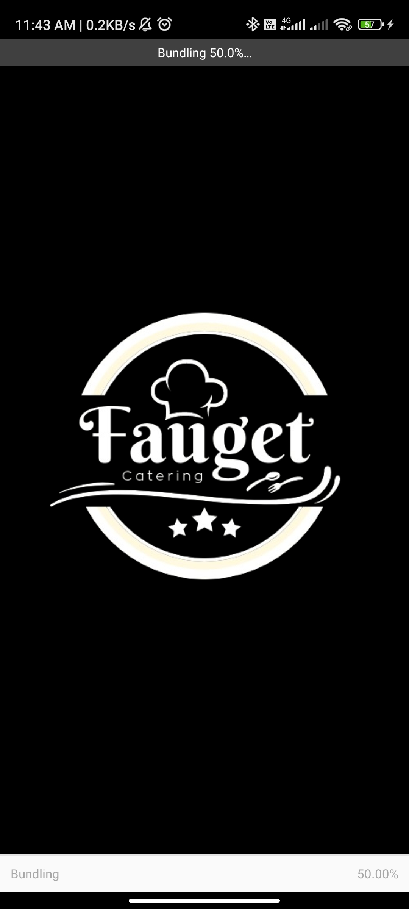
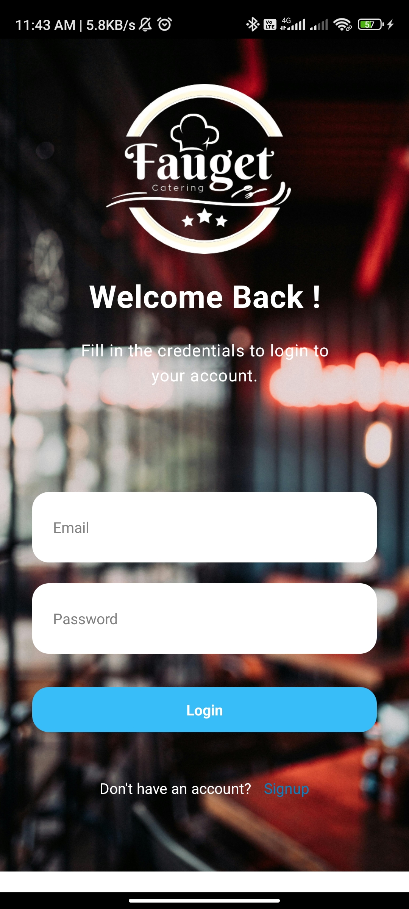

# Login App using React Native

  <!-- iOS -->
  
  <!-- Android -->
  
  <!-- Web -->

## Introduction

  This is a simple login app created using React Native and Tailwind CSS along with libraires like Reanimated for animation. 
  
  ### Splash Screen
    
  

  ### Login Screen
    
  

  ### Signup Screen
    
  

  

## 🚀 How to use

Install React Native and React Native Re-animated

> `npx create-expo my-app --example with-reanimated`

- Run `yarn` or `npm install`
- Run `yarn start` or `npm run android` to try it out.

Install tailwind CSS for React Native

>` npm install nativewind`
>`npx tailwind init`

Install React Native Screens

>`npx expo install react-native-screens react-native-safe-area-context`

  Install React Native Navigate for routing

>`npm install @react-navigation/native`
>`npm install @react-navigation/native-stack`

## 📝 Notes

- [`react-native-reanimated` docs](https://docs.swmansion.com/react-native-reanimated/)
